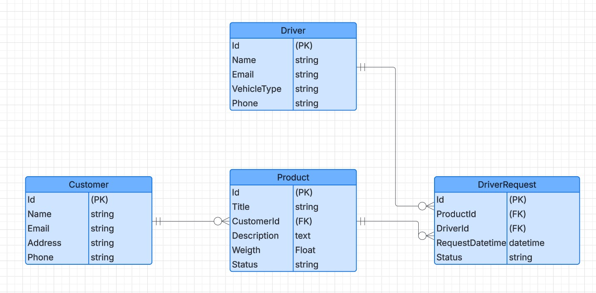

<h1>
  <span class="headline">Backend - Storage Tracker System (STS)</span>
</h1>

## Introduction

The Storage Tracker System **(STS)** is designed to allow **customers** to store their products, while **drivers** can browse available products, submit pickup requests, and view more details about the product storage process.

---

##  Description

The **Storage Tracker System (STS)** helps **customers** save their products in a storage system, and allows **drivers** to view these products, request to pick them up, and check more information about the storage process.The backend handles authentication, data management, and RESTful operations for both roles.

The backend of the **Storage Tracker System (STS)** is built using **Django** and **Django REST Framework (DRF)**. It provides a secure RESTful API that allows customers to manage product storage and drivers to submit and track pickup requests.


###  Frontend Repository

> [Frontend-STS GitHub Repo](https://github.com/AyDossari/Frontend-STS)

###  Tech Stack

- **Python 3**
- **Django**
- **Django REST Framework**
- **PostgreSQL**
- **Simple JWT**
- **python-dotenv**
- **django-cors-headers** 

###  ERD Diagram



###  Installation Instructions

#### 1. Clone the repository

```bash
git clone https://github.com/AyDossari/backend-STS.git
cd <repo-name>
```

#### 2. Create a virtual environment and activate it

```bash
python -m venv venv
source venv/bin/activate  # On Windows use: venv\Scripts\activate
```

#### 3. Setup `.env` file

Create a `.env` file at the root level and define the following variables:

```env
DB_NAME=your_database_name
DB_USER=your_database_user
DB_PASSWORD=your_database_password
DB_HOST=localhost
DB_PORT=5432
```

#### 4. Apply migrations and run the server

```bash
python manage.py makemigrations
python manage.py migrate
python manage.py runserver
```

###  API Routing Table

####  Authentication Endpoints

| Method | URL                    | Description                        |
|--------|------------------------|------------------------------------|
| POST   | `/api/token/`          | Obtain JWT tokens                  |
| POST   | `/api/token/refresh/`  | Refresh access token               |
| POST   | `/signup/customer/`    | Customer registration              |
| POST   | `/signup/driver/`      | Driver registration                |

####  Product Endpoints

| Method | URL                        | Description                |
|--------|----------------------------|----------------------------|
| GET    | `/products/`               | List all products          |
| POST   | `/products/`               | Create new product         |
| GET    | `/products/<id>/`          | Get product details        |
| PATCH  | `/products/<id>/`          | Partial update on product  |
| DELETE | `/products/<id>/`          | Delete a product           |

####  Driver Request Endpoints

| Method | URL                             | Description                        |
|--------|---------------------------------|------------------------------------|
| GET    | `/driver-requests/`             | List all pickup requests           |
| POST   | `/driver-requests/`             | Create a pickup request            |
| GET    | `/driver-requests/<id>/`        | Retrieve request details           |
| PATCH  | `/driver-requests/<id>/`        | Partially update a pickup request  |
| DELETE | `/driver-requests/<id>/`        | Delete a pickup request            |

---

###  IceBox Features

- Profile editing for both **Customers** and **Drivers** (update phone, address, vehicle info).
- Admin dashboard for managing users and data.

---

###  Wins & Challenges

I built the main APIs using Django and DRF, and added login with JWT. Connecting to PostgreSQL using .env worked after some tries. It was a bit tricky to handle roles for customer and driver, but I learned a lot.

